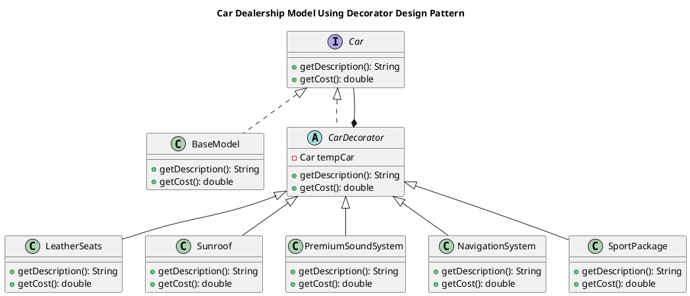
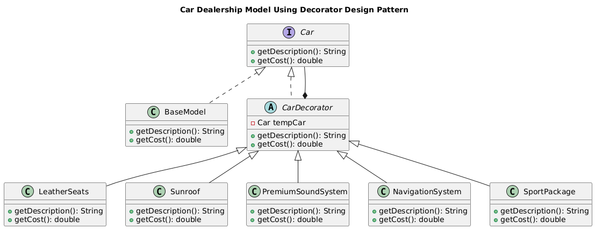

# Car Dealership Model Using Decorator Design Pattern

## Overview

## Features

- **Base Model:** Represents a basic vehicle without additional features.
- **Decorator Pattern:** Dynamically adds optional features like **Leather Seats, Sunroof, Premium Sound System, Navigation System, and Sport Package**.
- **Cost Calculation:** The total cost updates automatically as features are added.
- **Flexibility:** Any combination of features can be applied to a base model.
- **Test Code:** Demonstrates different configurations of the car model with options.

## Code Structure

### 1. **Core Interface: `Car`**

Defines the structure for all car objects.

```java
public interface Car {
    String getDescription();
    double getCost();
}
```

### 2. **Concrete Component: `BaseModel`**

Implements the `Car` interface, representing the standard vehicle.

```java
public class BaseModel implements Car {
    public String getDescription() {
        return "Base Model";
    }
    public double getCost() {
        return 25000.00;
    }
}
```

### 3. **Abstract Decorator: `CarDecorator`**

Extends `Car` and allows dynamic addition of features.

```java
public abstract class CarDecorator implements Car {
    protected Car tempCar;
    public CarDecorator(Car newCar) {
        this.tempCar = newCar;
    }
    public String getDescription() {
        return tempCar.getDescription();
    }
    public double getCost() {
        return tempCar.getCost();
    }
}
```

### 4. **Concrete Decorators: Feature Add-ons**

Each decorator extends `CarDecorator` and adds a specific feature.

Example: `LeatherSeats` Decorator

```java
public class LeatherSeats extends CarDecorator {
    public LeatherSeats(Car newCar) {
        super(newCar);
        System.out.println("Adding Leather Seats");
    }
    public String getDescription() {
        return tempCar.getDescription() + ", Leather Seats";
    }
    public double getCost() {
        return tempCar.getCost() + 1500.00;
    }
}
```

Other feature classes (`Sunroof`, `PremiumSoundSystem`, `NavigationSystem`, `SportPackage`) follow the same structure.

### 5. **Test Code: `CarTest.java`**

Demonstrates how to create and modify a car with various features.

```java
public class CarTest {
    public static void main(String[] args) {
        Car myCar = new BaseModel();
    
        // Adding all features step by step
        myCar = new LeatherSeats(myCar);
        myCar = new Sunroof(myCar);
        myCar = new PremiumSoundSystem(myCar);
        myCar = new NavigationSystem(myCar);
        myCar = new SportPackage(myCar);
    
        // Display final description and cost
        System.out.println(myCar.getDescription() + " Cost = $" + myCar.getCost());
    }
}
```

## UML Documentation

### Code

<details>
<summary>click to expand</summary>



</details>

### Image



## Running the Code

### Prerequisites

- Java Development Kit (JDK) installed.
- Any Java IDE (IntelliJ IDEA, Eclipse, NetBeans) or a simple text editor.

### Steps

1. **Compile the Code:**

   ```java
   javac *.java
   ```
2. **Run the Test Code:**

   ```java
   java CarTest
   ```

## Expected Output

* [ ]  Upon running `CarTest.java`, you should see:

```
Adding Leather Seats
Adding Sunroof
Adding Premium Sound System
Adding Navigation System
Adding Sport Package
Base Model, Leather Seats, Sunroof, Premium Sound System, Navigation System, Sport Package Cost = $31500.0
```
